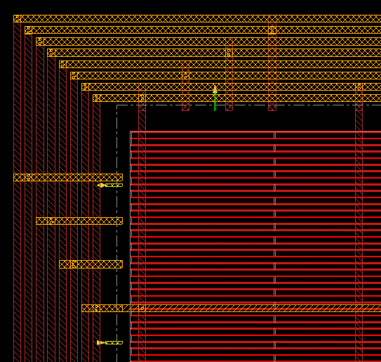

# Caravel User Project for the use of mflowgen with commercial EDA tools

This repository provides a template ASIC implementation flow for commercial EDA tools using the flow generator [mflowgen](https://github.com/mflowgen/mflowgen) for the [Google/efabless caravel MWP program](https://www.efabless.com/open_shuttle_program/2).

[mflowgen](https://github.com/mflowgen/mflowgen) is a modular flow specification and build-system generator that can be used to define implementation steps for both ASIC and FPGA designs using any process design kit, including the [Skywater open-source PDK](https://github.com/google/skywater-pdk).

## Features

Following features have been implemented so far:

- Basic implementation flow for the user_project_wrapper using Synopsys DC for synthesis, Cadence Innovus for PnR, Magic and Netgen for DRC and LVS
- Initial floorplan file for the user_project_wrapper for full power/ground design capabilities in Cadence Innovus
- Additional single-command automation to install and setup all repository dependencies
	+ mflowgen
	+ [skywater-130nm-adk](https://github.com/heavySea/skywater-130nm-adk) (mflowgen's PDK view) with automated file setup
	+ PDK, openLane, ... dependencies already provided by the source repository
- Single-command to build and clean implementation flows

Planned features are:
- Basic RTL and GL simulation flows using Mentor Modelsim and Power Estimation using Synopsys PrimeTime PX/PrimePower
- TLU+ file generation as done in https://github.com/google/skywater-pdk/pull/185
- user_proj_example flow

## Installation

To setup the caravel user project run the following steps.

1. Clone the repository
	```
	git clone https://github.com/efabless/caravel_user_project.git
	cd caravel_user_project
	```

2. Install the PDK
	
	The mflowgen ADK view for the Skywater 130nm process requires files from both the [google/skywater-pdk repository](https://github.com/google/skywater-pdk) as well as RTimothyEdwards/open_pdks(https://github.com/RTimothyEdwards/open_pdks) installation. The original caracel_user_project repository already provides an automated installation process.
	Refer to the original readme for build instructions:
	https://caravel-user-project.readthedocs.io/en/latest/#building-the-pdk
	Make sure to have the `PDK_ROOT` environment variable set all of the time.

3. Install all dependencies

	(Optional) Following installation paths and source links for the caravel, sky-130nm-adk and mflowgen can be configured:
	+ Caravel:
		* Change the install path with `CARAVEL_ROOT`, by default the caravel will be installed at `$(pwd)/caravel`
		* By default use the caravel-lite repository, otherwise run `export CARAVEL_LITE=0`
		* Change the caravel repository source with `CARAVEL_REPO`, by default the original repository from efabless is used
		* Change the caravel repository branch with `CARAVEL_BRANCH`, by default the master branch will be used 
    + OpenLane:
		* Change the the install path with `OPENLANE_ROOT`, by default the caravel will be installed at `$(pwd)/caravel`
		* By default use the caravel-lite repository, otherwise run `export CARAVEL_LITE=0`
	+ mflowgen:
		* Change the the install path with `MFLOWGEN_ROOT`, by default mflowgen will be installed at `$(pwd)/mflowgen/mflowgen`
		* Change the mflowgen repository source with `MFLOWGEN_REPO`, by default the [original repository](https://github.com/mflowgen/mflowgen)
		* Change the mflowgen repository branch with `MFLOWGEN_BRANCH`, by default the master branch will be used  
	+ sky-130nm-adk:
		* Change the the install path with `SKY_ADK_PATH`, by default the ADK will be installed at `$(pwd)/mflowgen/SKY130_ADK`
		* Change the ADK repository source with `SKY_ADK_REPO`, by default the [ADK repository with the automated installation process](https://github.com/heavySea/skywater-130nm-adk)
		* Change the ADK repository branch with `SKY_ADK_BRANCH`, by default the master branch will be used  

	Finally, you can run
	```
	make install
	```

	This will clone all repository dependencies, setup the ADK and install the mflowgen virtual environment.

5. Install Openlane

	OpenLane has been preserved to be used as well. So you can e.g. harden a macro using mflowgen, export the results and harden the caravel\_user\_project_wrapper with OpenLane.

	First set the path where openLane is/was installed as well as the repository tag to use and install openlane:
	```
	export OPENLANE_ROOT=<openlane-installation-path>
	export OPENLANE_TAG=<latest-openlane-tag>
	make openlane
	```

4. Single dependency installation, update and removal

	You can install all dependencies individually
	```
	make install_caravel
	make install_mflowgen
	make install_ADK
	```
	You can update all dependencies individually
	```
	make update_caravel
	make update_mflowgen
	make update_ADK
	```

	You can remove all dependencies or individually
	```
	## Remove all dependencies
	make uninstall
	## Remove a single dependency
	make uninstall_caravel
	make uninstall_mflowgen
	make uninstall_ADK
	```

## Quickstart to use mflowgen to harden designs and the caravel wrapper

Currently, this repository provides a single implementation flow to harden the user project wrapper including the example user project. But you can use it as a reference to harden your design with the [skwater-130nm-adk](https://github.com/heavySea/skywater-130nm-adk).
Each mflowgen flow must be put in the directory /mflowgen/flows.

To generate the mflowgen build environment for any flow in this directory and to start the flow you can use 

```
make mflowgen-*
```

E.g. to harden the user project wrapper with mflowgen run
```
make mflowgen-user_project_wrapper
```

This will create a new directory called build_user_project_wrapper and start the mflowgen build-system to generate the implementation pipeline. Afterwards, it will also start the implementation pipeline automatically, running all the flow tasks! If you want to run the flow manually, you can set
```
export MFLOWGEN_INTERACTIVE_FLOW=1
```

In interactive mode or after build has finished you can enter the build directory mflowgen/build_* and run
```
# cd the build directory:
# cd mflowgen/build_user_project_wrapper

source sourceme_mflowgen_env.sh
```
to enter the virtual environment for mflowgen.
Afterwards you can run the mflowgen commands such as
```
# show all steps and their build status
make status

# run a step
make 0

# show information about a specific step
make info-0

# re-generate the implementation graph
mflowgen run --update
```


More information about mflowgen can be found in the [documentation](https://mflowgen.readthedocs.io/en/latest/quick-start.html). A more detailed description of the intended integration is described below.

Build folders are ignored by git! The last step in the provided flow will export all required files into the caravel user project repository structure. 
To remove a build folder, you can run 
```
make clean-*
```

e.g. `make clean-user_project_wrapper`.


## Working with Mflowgen and caravel integration concepts

Mflowgen is a modular flow specification and build-system generator. It provides basic scripts for various open-source and industrial EDA tools for the RTL-2-GDS flow and verification, e.g. Synthesis in Synopsys DC or PnR in Cadence Innovus. The user can define his own flow using a Python API. 

So far a flow to harden the example user project wrapper including the example design is provided for the caravel project. Following, it will be used to shortly explain the work flow. You can find most discussed files under mflowgen/flows/user\_project\_wrapper.

### Defining an implementation flow

The implementation flow is defined in the `construct.py` script using the mflowgen Python API. The flow is represented as a graph that has nodes, called Steps, which are connected by Edges. Each Step represents a task in the implementation flow, e.g. gate-level synthesis. Steps require a defined input (e.g. the RTL verilog and constraints) and return some outputs (e.g. the synthesized netlist) which than again can be used by other Steps. Therefore, the graph Edges represent the dataflow between the steps.

The lines 
```
dc  = Step( 'synopsys-dc-synthesis', default=True )
rtl = Step( this_dir + '/design-rtl'        	  )
```
both generate an object of the mflowgen class Step. The first line uses a Step provided by the mflowgen repository found in mflowgen/mflowge/steps, while the second line references a "custom" Step anywhere else. Nevertheless, each Step is physically represented as a directory that contains a `configure.yml` file. The configuration file defines the inputs and outputs, pre- and postconditions for the task to be executable and the actual instructions what to do during the execution of the task.

The tasks are then added to the graph in the `construct.py` script:
```
g = Graph()

g.add_step( rtl )
g.add_step( dc  )
```

Finally the inputs and outputs of steps must be connected together. The easiest way to connect ports is to use
```
g.connect_by_name( rtl, dc )
```

### Mflowgen's Process Design Kit view (ADK)

Mflowgen is intended to be process independent. Thus, it defines a minimal default set of necessary files for various tools. For example, .lib, .lef, .v, etc. files from the sky130_fd_sc_hd library are renamed to the stdcells.* in the ADK view. The scripts of the implementation steps can then just use the generic stdcells.* name.
For the Sykwater 130nm PDK an automated ADK installation process is provided. Some vendor specific files which are not contained in the skywater-pdk or open-pdk installation are generated, while other files must be changed to fix open issues. More information about this can be found in the [sykwater-130nm-adk repo](https://github.com/heavySea/skywater-130nm-adk).

### Mflowgen's Build process

Once the ADK and implementation flow graph have been established the flow can be executed. In the repository root folder run

```
make mflowgen-*
# e.g. make flowgen-user_project_wrapper
```

This will create a new builder folder und mflowgen/build_*. The script enters the python virtual environment in which mflowgen was installed before. It will start the mflowgen build-generator, which generates a Makefile out of the given construct python script (e.g. mflowgen/flows/user\_project\_wrapper/construct.py). Afterwards, these make targets can be called to get build information, start single or multiple steps or delete them. 

```
# show all steps and their build status
make status

# run a step
make 0

# show information about a specific step
make info-0

# re-generate the implementation graph
mflowgen run --update
```

Every time a step is launched, the original step directory is "copied" into the build directory and made executable. Mflowgen generates an input directory and links all input files from previous steps to this input directory. Therefore, scripts of the step can just reference their required files from the input folder. Further information can be found in the [Mflowgen documentation](https://mflowgen.readthedocs.io/en/latest/quick-start.html).


## Caravel user project wrapper hardening with mflowgen

When hardening the `user_project_wrapper` using other tools than openLane the IO pin positions and metal rings must be the same for caravel integration. 
A straightforward way to assure equivalence is to use the empty floorplan of the wrapper from the openlane flow which is saved as .def file as an initial floorplan.
The 10th step of openlane generates a file called 10-pdn.def which is the result of the last floorplan step.

However, the floorplan already contains stripes across the whole die. To enable whole control over power planing, e.g. to create internal power rings for macros, multiple power domains, etc. the stripes have been cut of to the length of the regular IO pins. Later on new stripes of all or selected power nets can be generated using Innovus.




The flow script for the `user_project_wrapper` contains the step `caravel-uprj-floorplan` which generates the initial floorplan for Innovus from the openlane floorplan file. It supplies the result to both the innovus-flowesetup and innovus-init step. Moreover it needs to modify the innovus foundation-flow setup.tcl script as well as the script order and the floorplan.tcl script of the innovus-init step. This is done in the construct.py script:

```
init_order = caravel_upr_floorplan.get_param('iInit_order')
init.update_params({'order' : init_order})

iflow.extend_inputs(['setup.tcl'])
iflow.extend_inputs(['user_project_wrapper.def'])
init.extend_inputs(['user_project_wrapper.def', 'floorplan.tcl'])
```

More details about hardening the wrapper and macros and openlane refer to the README(TODO).

Hardening the wrapper is still experimental and not fully verified yet.
Of course you can just harden your design as macros using mflowgen and use openlane to harden the wrapper which is the recommended way by efabless.

## Openlane usage

The process to use openlane has not been changed except for the name of the make target. Once openlane is setup you cann harden macros and the wrapper by

```
# Run openlane to harden user_proj_example
make openlane-user_proj_example
# Run openlane to harden user_project_wrapper
make openlane-user_project_wrapper
```
For more details on openlane, refer to the [openlane README](https://github.com/efabless/caravel/blob/master/openlane/README.rst).

## Verification

The mflowgen implementation flow for the user\_project\_wrapper contains DRC and LVS verification steps using Magic and netgen. These are similar to the verification checks done in the precheck, but less sophisticated. 
GDS or DEF file to spice conversion to magic failes. Also the unmerged GDS file is used for extraction at this point, while the open-pdk LVS script use the merged GDS file for extraction.
DRC, spice extraction and LVS of the user_project_wrapper hardened with mflowgen is very slow, most propably because of all the filler cells which are added before routing. (Those are are missing in the openlane wrapper version).

Once the implementation results have been exported from the mflowgen build directory to the caravel user project repository structure, all pre-check targets should work as well. So you can run all check-targets (drc, lvs, etc.) mentioned in the [original README](https://caravel-user-project.readthedocs.io/en/latest/#other-miscellaneous-targets).

Currently timing sign-off is only done in Innovus, but planned to be done in Synopsys PrimeTime.

## Full-Chip Simulation

Currently using the default Icarus Verilog based simulation. See the [original README](https://caravel-user-project.readthedocs.io/en/latest/#running-full-chip-simulation).

Planned to be extended with Mentor Modelsim simulations.

## Known problems:

- magic DEF2SPICE and GDS2SPICE steps are failing 