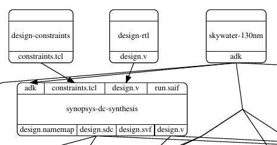
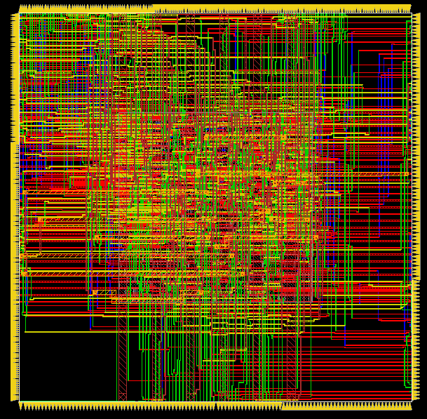
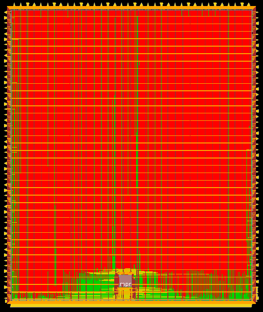
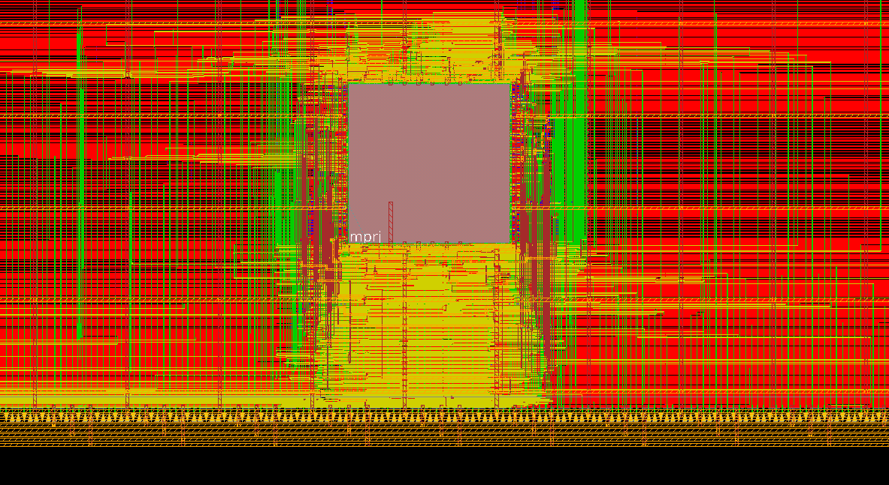
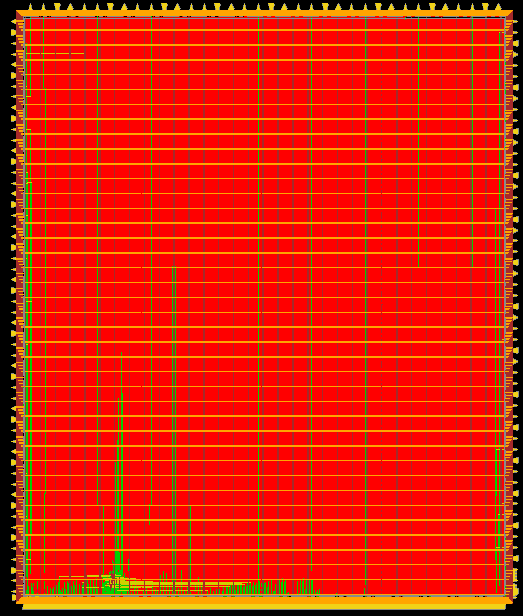
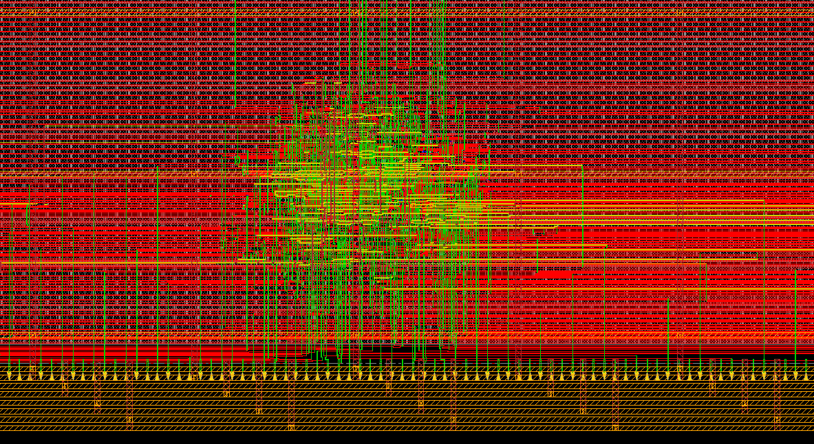
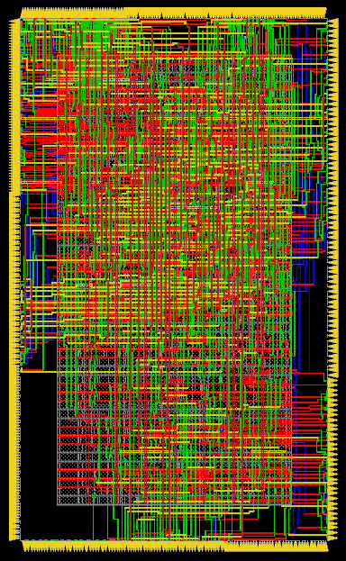
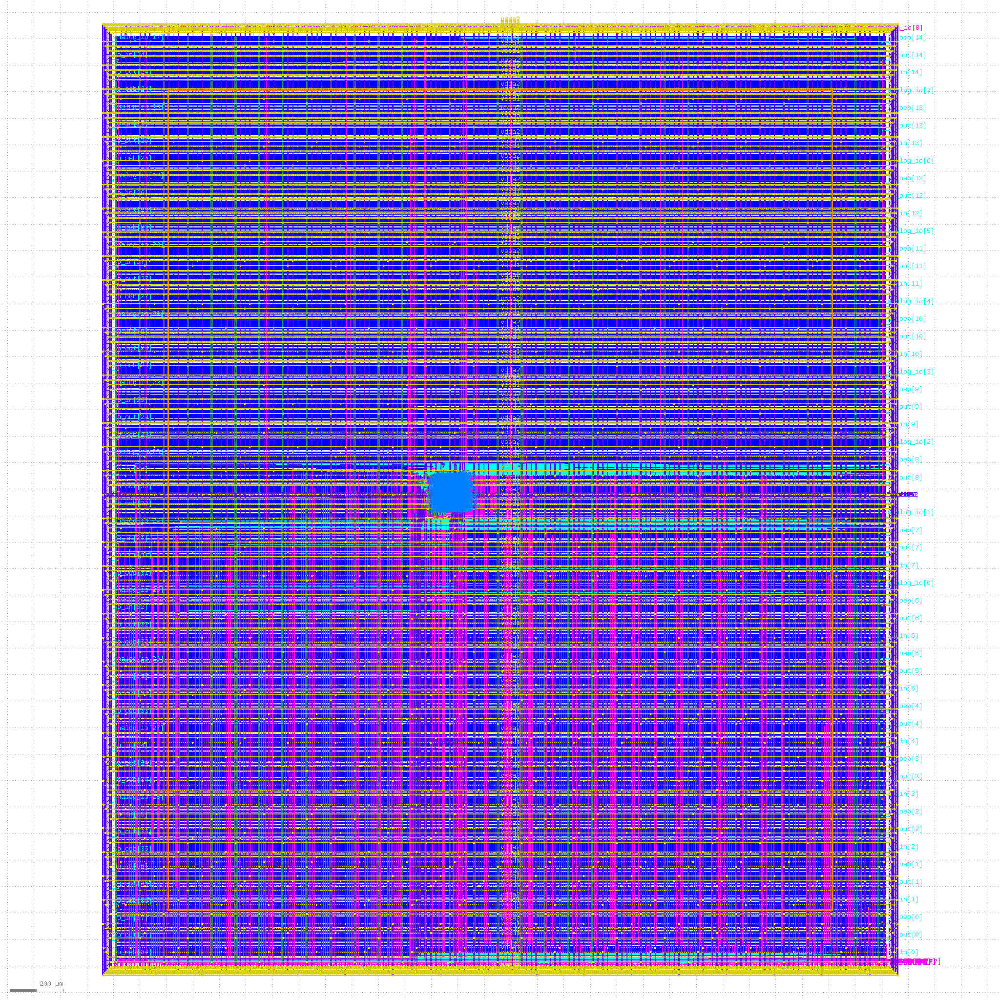

# Caravel User Project for the use of mflowgen with commercial EDA tools

This fork of the Google/efabless caravel MWP program](https://www.efabless.com/open_shuttle_program/2) provides a template ASIC implementation flow for commercial EDA tools using the flow generator [mflowgen](https://github.com/mflowgen/mflowgen).

[Mflowgen](https://github.com/mflowgen/mflowgen) is a modular flow specification and build-system generator that can be used to define implementation steps for both ASIC and FPGA designs using any process design kit, including the [Skywater open-source PDK](https://github.com/google/skywater-pdk).

This repository is providing experimental implementation flows to harden the example user project macro and the wrapper seperatly as well as to harden both togehter. The final goal is to have a stable and reproduceable base backend flow for the upcomming MWP runs using commercial EDA tools.

## Features

Following features have been implemented so far:

- Basic implementation flow for the user_project_wrapper and user_proj_example using Synopsys DC for synthesis, Cadence Innovus for PnR, Magic and Netgen for DRC and LVS
- Initial floorplan file for the user_project_wrapper for full power/ground design capabilities in Cadence Innovus
- Additional single-command automation to install and setup all repository dependencies
	+ [Mflowgen](https://github.com/mflowgen/mflowgen)
	+ [skywater-130nm-adk](https://github.com/heavySea/skywater-130nm-adk) (mflowgen's PDK view) with automated file setup
	+ PDK, openLane, ... dependencies already provided by the source repository
- Single-command to build and clean implementation flows using Mflowgen
- Template implementation flow for the user project example and user project wrapper with commercial and open-source EDA tools:

	* [ :heavy_multiplication_x: ] Implement example project and wrapper together with commercial tools
		```
		# Build with
		make mflowgen-user_project_wrapper
		```

		- [ :heavy_check_mark: ] Working mflowgen implementation flow
		- [ :question:] DRC - licon.8a DRV in buf_16 
		- [ :heavy_check_mark: ] LVS
		- [ :heavy_check_mark: ] Antenna
		- [ :heavy_check_mark: ] Full-Chip GL Simulation (with the caravel RTL model)
		- [ :x: ] Precheck passed (Failed due to magic xor check not finishing)
	* [ :construction: ] Implement example project tools as macro and used in wrapper with commercial tools
		```
		# Build with
		make mflowgen-user_proj_example
		make mflowgen-user_project_macro_wrapper
		```
		- [ :heavy_check_mark: ] Working mflowgen implementation flow for macro and wrapper
		- [ :heavy_check_mark: ] DRC, LVS, Antenna
		- [ :heavy_check_mark: ] Full-Chip GL Simulation (with the caravel RTL model)
		- [ :heavy_check_mark: ] Precheck passed
	* [ :construction: ] Implement example project tools as macro with commercial tools and used in wrapper with openLane
		- [ :heavy_check_mark: ] Working mflowgen implementation flow for macro
			
			Uses only up to metal 4 to be integrated in the openlane flow; contains only followpins and vertical stripes
		- [ :heavy_check_mark: ] Macro DRC, LVS, Antenna
		- [ :heavy_multiplication_x: ] Openlane wrapper hardening failes
			+ Either "Illegal overlap" errors during DEf2Spice Extraction when rectangular OBS is specified in LEF like mentioned [here](https://skywater-pdk.slack.com/archives/C016H8WJMBR/p1623645309353200)
			+ DRC error "Metal5 width < 1.6um (met5.1)" around met5 vias over macro already mentioned [here](https://skywater-pdk.slack.com/archives/C016YSAP6TZ/p1622211120130400)
		- [ :heavy_multiplication_x: ] Openlane wrapper LVS, DRC, Antenna
		- [ :heavy_multiplication_x: ] Openlane wrapper full-chip GL simulation
		- [ :heavy_multiplication_x: ] Precheck passed

([ :construction: ]: TBD; :heavy_check_mark:: done; [ :question: ]: untested; [ :heavy_multiplication_x: ]: failed)

Planned features are:
- Basic RTL and GL simulation flows using Mentor Modelsim and Power Estimation using Synopsys PrimeTime PX/PrimePower
- TLU+ file generation as done in https://github.com/google/skywater-pdk/pull/185
- Stable DRC and LVS
- SignOff report export to match the reports of openLane
- Put this long text into a nicer Sphinx Readme

## Installation

To setup the caravel user project run the following steps.

1. Clone the repository
	```
	git clone https://github.com/heavySea/caravel_user_project_mflowgen.git
	cd caravel_user_project_mflowgen
	```

2. Install the PDK
	
	The mflowgen ADK view for the Skywater 130nm process requires files from both the [google/skywater-pdk repository](https://github.com/google/skywater-pdk) as well as RTimothyEdwards/open_pdks(https://github.com/RTimothyEdwards/open_pdks) installation. The original caravel_user_project repository already provides an automated installation process.
	Refer to the original readme for build instructions:
	https://caravel-user-project.readthedocs.io/en/latest/#building-the-pdk
	
	Make sure to have the `PDK_ROOT` environment variable set all of the time.

3. Install all dependencies

	(Optional) Following installation paths and source links for the caravel, sky-130nm-adk and mflowgen can be configured:
	+ Caravel:
		* Change the install path with `CARAVEL_ROOT`, by default the caravel will be installed at `$(pwd)/caravel`
		* By default use the caravel-lite repository, otherwise run `export CARAVEL_LITE=0`
		* Change the caravel repository source with `CARAVEL_REPO`, by default the original repository from efabless is used
		* Change the caravel repository branch with `CARAVEL_BRANCH`, by default the master branch will be used 
    + OpenLane:
		* Change the the install path with `OPENLANE_ROOT`, by default the caravel will be installed at `$(pwd)/caravel`
		* By default use the caravel-lite repository, otherwise run `export CARAVEL_LITE=0`
	+ mflowgen:
		* Change the the install path with `MFLOWGEN_ROOT`, by default mflowgen will be installed at `$(pwd)/mflowgen/mflowgen`
		* Change the mflowgen repository source with `MFLOWGEN_REPO`, by default the [original repository](https://github.com/mflowgen/mflowgen)
		* Change the mflowgen repository branch with `MFLOWGEN_BRANCH`, by default the master branch will be used  
	+ sky-130nm-adk:
		* Change the the install path with `SKY_ADK_PATH`, by default the ADK will be installed at `$(pwd)/mflowgen/SKY130_ADK`
		* Change the ADK repository source with `SKY_ADK_REPO`, by default the [ADK repository with the automated installation process](https://github.com/heavySea/skywater-130nm-adk)
		* Change the ADK repository branch with `SKY_ADK_BRANCH`, by default the master branch will be used  

	Finally, you can run
	```
	make install
	```

	This will clone all repository dependencies, setup the ADK and install the mflowgen virtual environment.

5. Install Openlane

	OpenLane has been preserved to be used as well. So you can e.g. harden a macro using mflowgen, export the results and harden the caravel\_user\_project_wrapper with OpenLane. It is required for RTL and GL simulation as well.

	First set the path where openLane is/was installed as well as the repository tag to use and install openlane:
	```
	export OPENLANE_ROOT=<openlane-installation-path>
	export OPENLANE_TAG=<latest-openlane-tag>
	make openlane
	```

4. Single dependency installation, update and removal

	All dependencies, that are installed by `make install` in step 3 can also be installed individually
	```
	make install_caravel
	make install_mflowgen
	make install_ADK
	```
	You can update all dependencies individually
	```
	make update_caravel
	make update_mflowgen
	make update_ADK
	```

	The dependency installations can also be removed by
	```
	## Remove all dependencies
	make uninstall
	## Remove a single dependency
	make uninstall_caravel
	make uninstall_mflowgen
	make uninstall_ADK
	```

## Quickstart to use mflowgen to harden designs and the caravel wrapper

Currently, this repository provides three tool flows to harden the example user project as wrapper (`user_proj_example`), the user area wrapper as top module without standard cells (`user_project_macro_wrapper`) as well as a flow to harden both example project and wrapper in conjunction (`user_project_wrapper`).

All flow specifications can be found under the subdirectory `mflowgen/flows`.
To generate the mflowgen build environment for any flow in this directory and to start the flow you can use 

```
make mflowgen-*
```

E.g. to harden the user project wrapper with mflowgen run
```
make mflowgen-user_project_wrapper
```

This will create a new directory called build_user_project_wrapper in the mflowgen subdirectory and start the mflowgen build-system to generate the implementation pipeline. Afterwards, it will also start the implementation pipeline automatically, running all the flow tasks! If you want to run the flow manually, you can set
```
export MFLOWGEN_INTERACTIVE_FLOW=1
```

In interactive mode or after the build has finished you can enter the build directory mflowgen/build_* and run
```
# cd the build directory:
# cd mflowgen/build_user_project_wrapper

source sourceme_mflowgen_env.sh
```
to enter the virtual environment for mflowgen.
Afterwards you can run the mflowgen commands such as
```
# show all steps and their build status
make status

# run a step
make 0

# show information about a specific step
make info-0

# re-generate the implementation graph
mflowgen run --update
```


More information about mflowgen can be found in the [documentation](https://mflowgen.readthedocs.io/en/latest/quick-start.html). A more detailed description of the intended integration is described below.

Build folders are ignored by git! The last step in the provided flow will export all required files into the caravel user project repository structure. 
To remove a build folder, you can run 
```
make clean-*
```

e.g. `make clean-user_project_wrapper`.

The results of the hardening process are exported to the caravel user project directory structure (def, gds, ...).

## Working with Mflowgen and caravel integration concepts

Mflowgen is a modular flow specification and build-system generator. It provides basic scripts for various open-source and industrial EDA tools for the RTL-2-GDS flow and verification, e.g. Synthesis in Synopsys DC or PnR in Cadence Innovus. The user can then define his own backend-flow using a Python API. 

This repository provided three possible backend-flows which are described above. Following, the flow to harden both macro and wrapper together will be used to shortly explain the operating principle of mflowgen. You can find most discussed files under mflowgen/flows/user\_project\_wrapper.

### Defining an implementation flow

The implementation flow is defined in the `construct.py` script using the mflowgen Python API. The flow is represented as a graph that has nodes, called Steps, which are connected by Edges. Each Step represents a task in the implementation flow, e.g. gate-level synthesis. Steps have a defined input (e.g. the RTL verilog and constraints) and return some outputs (e.g. the synthesized netlist) which than again can be used by other Steps. Therefore, the graph Edges represent the dataflow between the steps.



The lines in `construct.py`
```
dc  = Step( 'synopsys-dc-synthesis', default=True )
rtl = Step( this_dir + '/design-rtl'        	  )
```
both generate an object of the mflowgen class Step. The first line uses a Step provided by the mflowgen repository found in [mflowgen/mflowge/steps](https://github.com/mflowgen/mflowgen/tree/master/steps), while the second line references a "custom" Step anywhere else. Each Step is physically represented as a directory that contains a `configure.yml` file. The configuration file defines the inputs and outputs, pre- and postconditions for the task to be executable and the actual instructions what to do during the execution of the task.

A minimal configuration file `configure.yml` could look like this:
```
# Define the name of the step as it is used by the mflowgen generator
# Preferably it should be the same as the name of the directory

name: cadence-innovus-signoff

# Define the names of the files or directories which are required as inputs
# to the step

inputs:
  # The PDK view which required in almost all steps
  - adk
  # Some other input files
  - design.v
  - required_input_2

# Define the names of the files or directories that are generated by the step
# and are to be used by other subsequent steps

outputs:
 - result_1.v
 - reports

# Define the commands that are to be executed during this step
# They are called throug a script shell, thus all shell commands can be used 

commands:
  - mdkir a_working_dir && cd a_working_dir
  - ln -sf ../some_file some_file
  - run_a_program $some_parameter

# Parameters can be defined to influence the behaviour of steps or control executed pograms
# They are transformed into environment variables that are alive during the
# execution of the step!

parameters:
  # Som
  is_this_useful: True
  some_parameter: foo

```


The tasks are then added to the graph in the `construct.py` script:
```
g = Graph()

g.add_step( rtl )
g.add_step( dc  )
```

Finally the inputs and outputs of steps must be connected together. The easiest way to connect ports is to use
```
g.connect_by_name( rtl, dc )
```

### Mflowgen's Process Design Kit view (ADK)

Mflowgen is intended to be process-independent. Thus, it defines a minimal default set of necessary files for various tools with pre-defined names. For example, .lib, .lef, .v, etc. files from the sky130_fd_sc_hd library are renamed to the stdcells.* in the ADK view. The scripts of the implementation steps can then just use the generic stdcells.* name.
For the Sykwater 130nm PDK an automated ADK installation process is provided. Some vendor specific files which are not contained in the skywater-pdk or open-pdk installation are generated. Some required fixes from open issues within the library are also automatically done. More information about this can be found in the [sykwater-130nm-adk repo](https://github.com/heavySea/skywater-130nm-adk).

### Mflowgen's Build process

Once the ADK and the implementation flow graph have been established the flow build-generator can be executed. In the repository root folder run

```
make mflowgen-*
# e.g. make flowgen-user_project_wrapper
```

This will create a new build folder under mflowgen/build_*. The script enters the python virtual environment in which mflowgen was installed before. It will start the mflowgen build-generator, which generates a Makefile out of the given construct python script (e.g. mflowgen/flows/user\_project\_wrapper/construct.py). Afterwards, these make targets can be called to get build information, start single or multiple steps or delete them. 

```
# show all steps and their build status
make status

# run a step
make 0

# show information about a specific step
make info-0

# re-generate the implementation graph
mflowgen run --update
```

Every time a step is launched, the original step directory is "copied" into the build directory and made executable. Mflowgen generates an input directory and links all input files from previous steps to this input directory. Therefore, scripts of the step can just reference their required files from the input folder. Further information can be found in the [Mflowgen documentation](https://mflowgen.readthedocs.io/en/latest/quick-start.html).


## Caravel user project wrapper hardening with mflowgen

When hardening the caracel user area wrapper using other tools than openLane the IO pin positions and metal rings must be the same for caravel integration. 
A straightforward way to assure equivalence is to use the empty floorplan of the wrapper from the openlane flow which is saved as .def file as an initial floorplan.
The 10th step of openlane generates a file called 10-pdn.def which is the result of the last floorplan step.

However, the floorplan already contains stripes across the whole die. To enable whole control over power planing, e.g. to use all metal layers in macros, create internal power rings around macros, use multiple power domains, etc. the stripes have been cut of to the length of the regular IO pins. Later on, new stripes of all or selected power nets can be generated using Innovus.


The flow specifications for `user_project_wrapper` and `user_project_macro_wrapper` contain a `caravel-uprj-floorplan` step which generates the initial floorplan for Innovus from the openlane floorplan file. It supplies the result to both the innovus-flowesetup and innovus-init step.
From there on the floorplan is further modified for each specific design. Have a look in the `construct.py` script of the wrapper hardening specification scripts.

More details about hardening the wrapper and macros and openlane refer to the TODO.

Hardening the wrapper is still experimental and not fully verified yet.
Of course you can just harden your design as macros using mflowgen and use openlane to harden the wrapper which is the recommended way by efabless. Though, the highes allowed metal to be used in the macro must be changed! (TODO)

## Openlane usage

The process to use openlane has not been changed except for the name of the make target. Once openlane is setup you cann harden macros and the wrapper by

```
# Run openlane to harden user_proj_example
make openlane-user_proj_example
# Run openlane to harden user_project_wrapper
make openlane-user_project_wrapper
```
For more details on openlane, refer to the [openlane README](https://github.com/efabless/caravel/blob/master/openlane/README.rst).

## Verification

All provided mflowgen implementation flows contain DRC and LVS verification steps using Magic and Netgen. These are similar to the verification checks done in the precheck. 
DRC, spice extraction and LVS of the flat `user_project_wrapper` flow is very slow, most propably because of all the filler cells which are added before routing. (Those are are missing in the openlane wrapper version).

Once the implementation results have been exported from the mflowgen build directory to the caravel user project repository structure, all pre-check targets should work as well. So you can run all check-targets (drc, lvs, etc.) mentioned in the [original README](https://caravel-user-project.readthedocs.io/en/latest/#other-miscellaneous-targets).

Currently timing sign-off is only done in Innovus, but planned to be done in Synopsys PrimeTime.

## Full-Chip Simulation

Currently you need to use the default Icarus Verilog based simulation make targets. See the [original README](https://caravel-user-project.readthedocs.io/en/latest/#running-full-chip-simulation).

Planned to be extended with Mentor Modelsim simulations.


Gate-Level simulation is still not working due to open issues of the caravel. You can use the RTL models of the caravel with the gate-level netlists of your wrapper, but only for functional simulation without timing annotations.

For this, edit following lines in ($CARAVEL_ROOT)/verilog/rtl/caravel\_netlist.v
```
 //`ifdef GL
//	`include "gl/mgmt_core.v"
//	`include "gl/digital_pll.v"
//	`include "gl/DFFRAM.v"
//	`include "gl/storage.v"
//	`include "gl/user_id_programming.v"
//	`include "gl/chip_io.v"
//	`include "gl/mprj_logic_high.v"
//    `include "gl/mprj2_logic_high.v"
//	`include "gl/mgmt_protect.v"
//    `include "gl/mgmt_protect_hv.v"
//	`include "gl/gpio_control_block.v"
//	`include "gl/sky130_fd_sc_hvl__lsbufhv2lv_1_wrapped.v"
 //   `include "gl/caravel.v"
//`else
	`include "mgmt_soc.v"
	`include "housekeeping_spi.v"
	`include "caravel_clocking.v"
	`include "mgmt_core.v"
	`include "digital_pll.v"
	`include "DFFRAM.v"
	`include "DFFRAMBB.v"
	`include "storage.v"
	`include "user_id_programming.v"
	`include "clock_div.v"
	`include "storage_bridge_wb.v"
	`include "mprj_io.v"
	`include "chip_io.v"
	`include "mprj_logic_high.v"
    `include "mprj2_logic_high.v"
	`include "mgmt_protect.v"
    `include "mgmt_protect_hv.v"
	`include "gpio_control_block.v"
    `include "sky130_fd_sc_hvl__lsbufhv2lv_1_wrapped.v"
    `include "caravel.v"
//`endif
```

## Flow specification details and results

Follows soon. For now only some pretty pictures

### Example user project



### User project wrapper using the example user project macro




### Flat example user project + wrapper




### Innovus example user project + Openlane wrapper
Innovus example user project



Openlane Wrapper



## Known problems

- XOR pre-checks failed with the flat `user_project_wrapper` flow, because magic hangs during the deletion of the wrapper content 
- User-Grid not set properly in Innovus for the wrapper?

## Contributions

[Mflowgen](https://github.com/mflowgen/mflowgen) is authored and maintained by Christopher Torng and offered under the terms of the Open Source Initiative BSD 3-Clause License.

The [skywater-130nm-ADK repository](https://github.com/heavySea/skywater-130nm-adk) used here has been derived from the [ADK repository of Priyanka Raina, Stanford University course EE272](https://code.stanford.edu/ee272/skywater-130nm-adk). 
The implementation flow has also been derived from the [skywater-digital-flow repository](https://code.stanford.edu/ee272/skywater-digital-flow) by Priyanka Raina, Stanford University course EE272.

MWP Caravel related files are provided by Efabless as in the original [caravel_user_project](https://github.com/efabless/caravel_user_project) repository.
